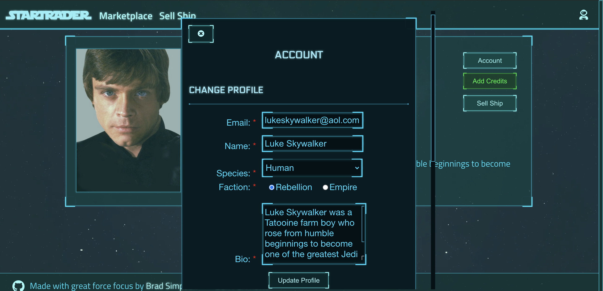

# StarTrader
*By [(Darth) Ben Perlmutter](http://ben.perlmutter.io/) and [Brad (Kenobi) Simpson](https://github.com/bradsimpson213) - [Live site](https://startrader-app.herokuapp.com/)*

A long time ago in a galaxy far, far away...They needed a platform to sell used starships.

**Table of Contents**
  * [StarTrader at a Glance](#startrader-at-a-glance)
  * [Technologies Used](#technologies-used)
  * [Application Architecture](#application-architecture)
  * [Frontend Overview](#frontend-overview)
  * [Backend Overview](#backend-overview)
  * [Conclusion](#conclusion)

## StarTrader at a Glance
StarTrader is a full stack starship trading application for the Star Wars universe. Users can buy and sell their favorite starships from Star Wars. You can buy the Millennium Falcon from Han Solo, the Death Star from Admiral Tarkin, and more!  

The application is made with a React frontend and the Arwes sci-fi UI library. The backend is a Flask server with a Postgres database. 

**Key Features**
* Create new users and have user login with authorization
* Buy and sell starships (include unique special ships)
* Post new starships for sale (only basic not unique)
* Search for starships by starship class  in the interface bar

## Technologies Used
* Frontend
  * React 
  * Javascript 
  * [Awres](https://arwes.dev/) sci-fi UI framework
* Backend
  * Flask
  * Python 
  * Postgres
  * [SWAPI dataset](https://swapi.dev/)
  * Heroku deployment

## Application Architecture
The frontend is a `create-react-app` deployed to its own Heroku server and the backend deployed to a separate Heroku server. The two servers communicate with each other through RESTful APIs. 

##### Overview of application architecture

##### StarTrader Postgres database schema

## Frontend Overview
The React frontend is built based off of the Arwes sci-fi UI library. Arwes provides a set of components that give the website a sci-fi look and feel appropriate for the Star Wars theme. 

Arwes was absolutely invaluable in providing the core building blocks for the UI. However, it has a fairly minimal component set, missing certain core functional components like modals and inputs. The presented the design challenge of envisioning and creating these essential components while remaining true to the existing Awres framework. 

Styling was handled using the JSS tool to write CSS in JavaScript. The application is fully mobile responsive.

Here's an example of the modal component used to edit the profile account, which is made fully of custom components but  emulates the existing Arwes framework. 

## Backend Overview
The Flask backend is a collection of RESTful routes serving data to the frontend and an interface with the Postgres database. 

The database is queried using the SQLAlchemy ORM, and seed data was added using the Alembic library. The seed data was of particular importance to this application because we wanted to include a lot of Star Wars related data. 

The data was provided via the Star Wars API (SWAPI) data. We used the data to create the models for adding listings and to create users based on the Star Wars films' characters. 

Images were hosted in an Amazon S3 container. 

## Conclusion
StarTrader was a ton of fun to make because we both (Ben and Brad), are big Star Wars fans. 

We think it turned out pretty good. We hit all of the features we wanted to hit, and didn't encounter any serious blockers throughout the development process. We learned a lot about both front and backend.

The force was with us on this project. 